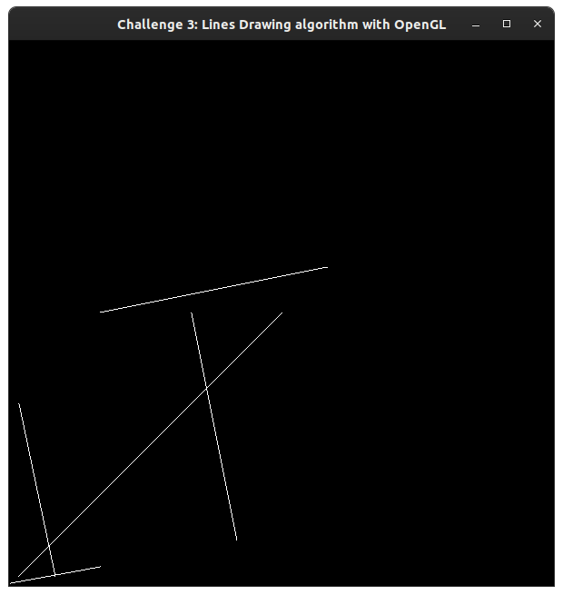

# Challenge 3 - Lines Drawing algorithm with OpenGL

## Instructions

1. Clone the repository to your local machine
2. Compile the code using the following command: `g++ -o main main.cpp -lGL -lGLU -lglut`
3. Run the executable file: `./main`

## Description

This program draws a line between two points using OpenGL.

## Test Cases

1. (1,2), (100,20)
1. (10,200), (50,10)
1. (300,300), (10,10)
1. (200,300), (250,50)
1. (350,350), (100, 300)

## Results

This is the result of the test cases.
