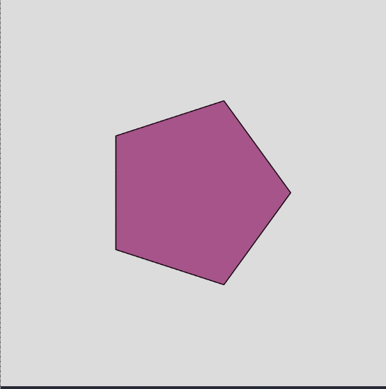

# Challenge 4 - Polygons drawing with Processing

## Instructions

1. Clone the repository to your local machine.
2. Open the file `index.html` in your browser.

## Description

This challenge is about drawing polygons using the Processing library. By default, the program will start drawing a random-color filled pentagon (5 sides) Then, for every left-button mouse click, the polygon will increase its sides by one, and it will be filled with a new random color. The maximum number of sides is 12 Once your program reach the maximum number of sides, it will go back to the pentagon.

## Preview

