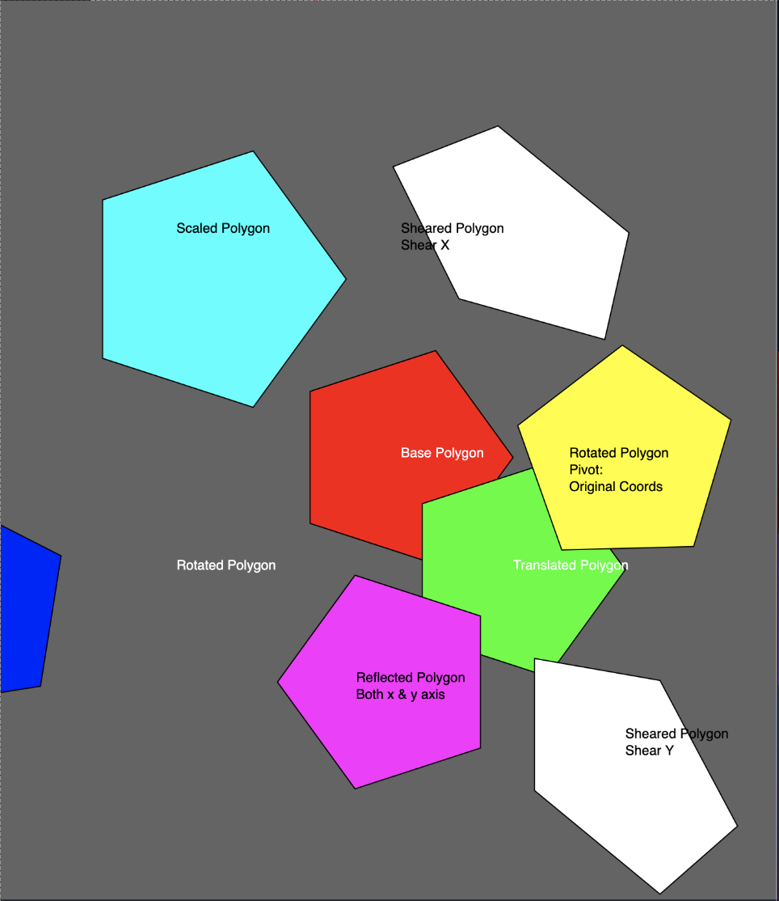

# Challenge 5 - Transformations

## Instructions

1. Clone the repository to your local machine.
2. Open the file `index.html` in your browser.

## Description

Implement the following transformations by using the default template at: [https://editor.p5js.org/obedmr/sketches/mogmiO7ma](https://editor.p5js.org/obedmr/sketches/mogmiO7ma)

- Translation
- Rotation
- Scaling
- Reflection (select only one)
- ShearX
- ShearY

## Preview

