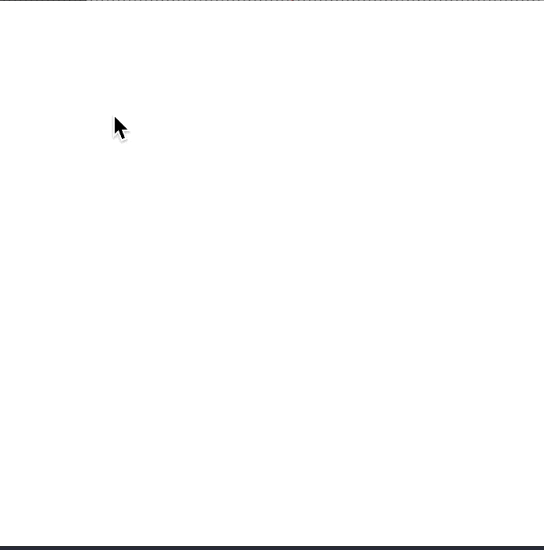

# Challenge 6 - Dynamic curves drawing

## Instructions

1. Clone the repository to your local machine.
2. Open the file `index.html` in your browser.

## Description

In Processing, create a curve drawing application with the following expects:

- **First, draw a line with the mouse.**
  - Click and while you're pressing the mouse the line is growing or decreasing.
  - Once the mouse click is released, the line is finished in the last mouse cursor position
- **Second, define (with mouse clicks) your control points (draw them)**
  - Once your control points are defined, remove the previous created line and draw the curve that is defined by your control points
  - You can use any supported curve functions in Processing
- **Third, add the capability of moving your control points (with the mouse)**

## Preview

