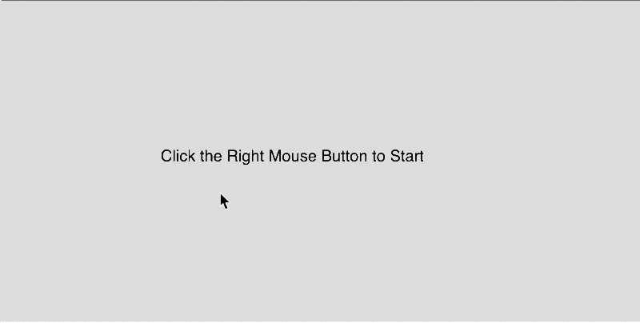

# Challenge 7 - Bouncing-ball simulation

## Instructions

1. Clone the repository to your local machine.
2. Open the file `index.html` in your browser.

## Description

Your program will be showing 3 stages or scenes that will be transitioned by a mouse right-click.

Below the 3 main stages or scenes of your program

- **Click 1** - Define and draw your ball's trajectory and draw it. You can use 2 curves, one that is going down and one that is going up.

- **Click 2** - Draw a summary of your storyboard based on figures 4 and 5. Only draw some selected frames that will provide a glimpse of your animation.

- **Click 3** - Run your ball-bouncing simulation. Your ball will follow the pre-defined curved trajectories. Your ball will be deformed as it's going down/up.

## Preview

